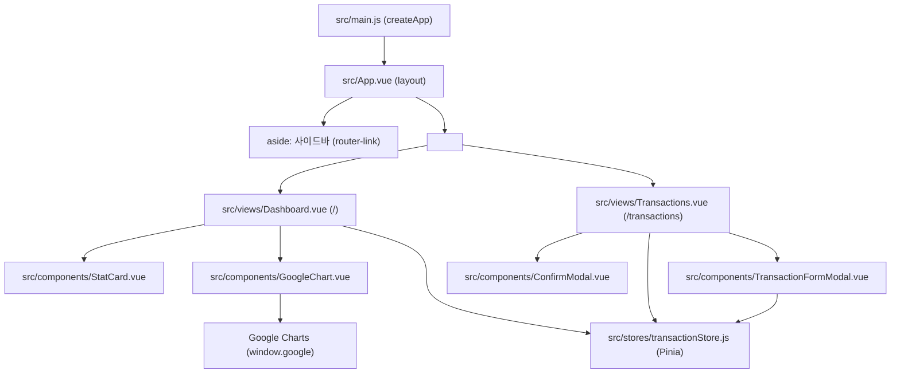

# 💰 Lovable AI - 가계부 대시보드

> Vue 3와 json-server를 활용한 현대적인 가계부 관리 애플리케이션
> 직관적인 UI로 금융 거래를 추적하고 시각화하는 스마트 대시보드


---

## 📋 목차

- [프로젝트 개요](#-프로젝트-개요)
- [주요 기능](#-주요-기능)
- [기술 스택](#-기술-스택)
- [설치 및 실행](#-설치-및-실행)
- [프로젝트 구조](#-프로젝트-구조)
- [스크린샷](#-스크린샷)
- [API 구조](#-api-구조)
- [기여 가이드](#-기여-가이드)

---

## 🎯 프로젝트 개요

**Lovable AI**는 개인의 금융 거래를 효율적으로 관리하고 시각화하는 Vue 3 기반의 현대적 가계부 애플리케이션입니다.

### ✨ 특징

- 🚀 **빠른 성능**: Vite 번들러로 초고속 개발/빌드
- 📊 **실시간 데이터 동기화**: json-server와 axios 기반 API 통신
- 🎨 **반응형 UI**: Bootstrap 5로 모든 디바이스에 최적화
- 📈 **고급 차트**: Google Charts를 이용한 아름다운 데이터 시각화
- 🔄 **상태 관리**: Pinia로 안전한 전역 상태 관리
- 🧭 **라우팅**: Vue Router 4로 부드러운 페이지 네비게이션

---

## 💡 주요 기능

| 기능 | 설명 | 아이콘 |
|------|------|--------|
| **대시보드** | 월별 수입/지출 요약, 카테고리별 분석 | 📊 |
| **거래 관리** | 거래 생성, 조회, 수정, 삭제 (CRUD) | 💳 |
| **차트 분석** | 3종 차트로 금융 데이터 시각화 | 📈 |
| **카테고리 분류** | 음식, 교통, 쇼핑 등 자동 분류 | 🏷️ |
| **거래 이력** | 최근 거래 목록 빠른 조회 | ⏱️ |
| **통계 계산** | 월별, 카테고리별 자동 집계 | 🔢 |

---

## 🛠️ 기술 스택

### Frontend

```
┌─────────────────────────────────────┐
│         Frontend Layer               │
├─────────────────────────────────────┤
│  • Vue 3 (Composition API)          │
│  • Vue Router 4 (라우팅)            │
│  • Pinia 2 (상태 관리)              │
│  • Vite 5 (번들러)                  │
│  • Bootstrap 5 (UI 프레임워크)      │
│  • Font Awesome 6 (아이콘)          │
│  • Google Charts (데이터 시각화)    │
└─────────────────────────────────────┘
         ↓ HTTP (Axios)
┌─────────────────────────────────────┐
│      Backend (json-server)          │
├─────────────────────────────────────┤
│  • REST API Server                  │
│  • JSON 기반 데이터 저장            │
│  • 거래 및 카테고리 CRUD API       │
└─────────────────────────────────────┘
```

### 주요 의존성

| 패키지 | 버전 | 역할 |
|--------|------|------|
| `vue` | ^3.4.0 | 프론트엔드 프레임워크 |
| `vue-router` | ^4.3.0 | 페이지 라우팅 |
| `pinia` | ^2.1.7 | 전역 상태 관리 |
| `axios` | ^1.6.0 | HTTP 클라이언트 |
| `bootstrap` | ^5.3.3 | CSS 프레임워크 |
| `@fortawesome/fontawesome-free` | ^6.5.0 | 아이콘 라이브러리 |
| `vite` | ^5.2.0 | 번들러 & 개발 서버 |
| `json-server` | ^0.17.4 | Mock REST API 서버 |

---

## 🚀 설치 및 실행

### 전제 조건

- Node.js >= 16.x
- npm >= 8.x

### 설치

```bash
# 저장소 클론
git clone https://github.com/ryeon-xx/lovable-ai.git
cd lovable-ai

# 디렉토리 이동
cd vue-app

# 의존성 설치
npm install
```

### 실행

#### 🔥 한 줄로 실행 (권장)

```bash
npm start
```

- ✅ json-server: `http://localhost:3001` (API 서버)
- ✅ Vite Dev Server: `http://localhost:5173` (웹 앱)

#### 개별 실행

```bash
# Terminal 1: json-server 시작
npm run server

# Terminal 2: Vite 개발 서버 시작
npm run dev
```

### 빌드

```bash
# 프로덕션 빌드
npm run build

# 빌드 결과 미리보기
npm run preview
```

---

## 📁 프로젝트 구조

```
lovable-ai/
├── vue-app/
│   ├── public/                    # 정적 자산
│   ├── src/
│   │   ├── components/            # 재사용 가능한 Vue 컴포넌트
│   │   │   ├── Header.vue
│   │   │   ├── Sidebar.vue
│   │   │   └── TransactionCard.vue
│   │   │
│   │   ├── views/                 # 페이지 컴포넌트
│   │   │   ├── Dashboard.vue      # 📊 대시보드 (요약 + 차트)
│   │   │   ├── Transactions.vue   # 💳 거래 목록
│   │   │   └── Settings.vue       # ⚙️ 설정
│   │   │
│   │   ├── stores/                # Pinia 상태 관리
│   │   │   └── transactionStore.js # 거래 관련 상태 & API 통신
│   │   │
│   │   ├── services/              # 비즈니스 로직 & API
│   │   │   └── api.js             # Axios 인스턴스
│   │   │
│   │   ├── App.vue                # 루트 컴포넌트
│   │   ├── main.js                # 애플리케이션 진입점
│   │   └── router.js              # Vue Router 설정
│   │
│   ├── db.json                    # 💾 Mock 데이터 (거래 100건)
│   ├── package.json               # 의존성 관리
│   ├── vite.config.js             # Vite 설정
│   └── index.html                 # HTML 진입점
│
└── README.md                      # 이 파일
```

---

## 🧩 컴포넌트 구성도

앱 진입(`main.js`) → 레이아웃(`App.vue`) → 라우팅(`/`, `/transactions`)을 거쳐 페이지 컴포넌트와 하위 컴포넌트가 렌더링됩니다.



### 핵심 파일 설명

#### 📊 `src/stores/transactionStore.js`

```javascript
// Pinia 스토어 - 전역 상태 관리
import { defineStore } from 'pinia'
import api from '@/services/api'

export const useTransactionStore = defineStore('transaction', () => {
  // 상태
  const transactions = ref([])
  const categories = ref([])
  
  // 액션
  const fetchTransactions = async () => {
    const response = await api.get('/transactions')
    transactions.value = response.data
  }
  
  const addTransaction = async (data) => {
    const response = await api.post('/transactions', data)
    transactions.value.push(response.data)
  }
  
  // 계산된 속성 (통계)
  const monthlyTotal = computed(() => {
    return transactions.value.reduce((sum, t) => sum + t.amount, 0)
  })
  
  return {
    transactions,
    categories,
    fetchTransactions,
    addTransaction,
    monthlyTotal
  }
})
```

#### 🔗 `src/services/api.js`

```javascript
// Axios 인스턴스 설정
import axios from 'axios'

const api = axios.create({
  baseURL: 'http://localhost:3001',
  timeout: 10000,
  headers: {
    'Content-Type': 'application/json'
  }
})

export default api
```

#### 🗂️ `db.json`

```json
{
  "transactions": [
    {
      "id": 1,
      "date": "2026-05-01",
      "category": "식비",
      "amount": -50000,
      "description": "점심 식사",
      "type": "expense"
    },
    {
      "id": 2,
      "date": "2026-05-02",
      "category": "급여",
      "amount": 3000000,
      "description": "월급",
      "type": "income"
    }
  ],
  "categories": [
    { "id": 1, "name": "식비", "icon": "utensils", "type": "expense" },
    { "id": 2, "name": "교통", "icon": "car", "type": "expense" },
    { "id": 3, "name": "쇼핑", "icon": "shopping-bag", "type": "expense" }
  ]
}
```

---

## 📸 스크린샷

### 🏠 대시보드 화면

```
┌────────────────────────────────────────────────────┐
│  💰 Lovable AI 가계부                              │
├────────────────────────────────────────────────────┤
│                                                    │
│  ┌──────────────┐  ┌──────────────┐ ┌─────────┐ │
│  │ 💵 지출      │  │ 💸 수입      │ │ 💳 잔액 │ │
│  │ ₩1,250,000   │  │ ₩3,000,000   │ │₩1,750,000│
│  └──────────────┘  └──────────────┘ └─────────┘ │
│                                                    │
│  📊 카테고리별 지출 현황          📈 월별 추이   │
│  ┌─────────────────────┐      ┌─────────────────┐│
│  │ 🍽️ 식비    40%      │      │ 📊 라인 차트    ││
│  │ 🚗 교통    30%      │      │                 ││
│  │ 🛍️ 쇼핑    20%      │      │                 ││
│  │ 🎬 여가    10%      │      │                 ││
│  └─────────────────────┘      └─────────────────┘│
│                                                    │
│  ⏱️ 최근 거래                                     │
│  ├─ 2026-05-07 | 식비 | -₩45,000 | 점심 식사    │
│  ├─ 2026-05-06 | 교통 | -₩5,500  | 택시비      │
│  └─ 2026-05-05 | 급여 | +₩3,000,000 | 월급    │
│                                                    │
└────────────────────────────────────────────────────┘
```

### 💳 거래 목록 화면

```
┌────────────────────────────────────────────────────┐
│  💳 거래 관리                                       │
├────────────────────────────────────────────────────┤
│                                                    │
│  🔍 검색: [_______________] 🏷️ 카테고리 필터 ▼  │
│                                                    │
│  ┌──────────────────────────────────────────────┐ │
│  │ 날짜      │ 카테고리 │ 금액      │ 설명      │ │
│  ├──────────────────────────────────────────────┤ │
│  │2026-05-07 │ 식비🍽️  │-₩45,000  │점심 식사  │ │
│  │2026-05-06 │ 교통🚗  │-₩5,500   │택시비    │ │
│  │2026-05-05 │ 급여💰  │+₩3,000,000│월급    │ │
│  │2026-05-05 │ 쇼핑🛍️ │-₩120,000 │옷 구매   │ │
│  │2026-05-04 │ 여가🎬  │-₩35,000  │영화표   │ │
│  └──────────────────────────────────────────────┘ │
│                                                    │
│  📄 페이지: 1 / 5        [+ 새 거래 추가]        │
│                                                    │
└────────────────────────────────────────────────────┘
```

### ➕ 거래 추가 대화창

```
┌──────────────────────────────────────────┐
│  ➕ 새 거래 추가                          │
├──────────────────────────────────────────┤
│                                          │
│  📅 날짜:     [2026-05-07]              │
│                                          │
│  🏷️ 카테고리:  [식비 ▼]                │
│                                          │
│  💰 금액:     [___________] 원          │
│                                          │
│  📝 설명:     [___________________]     │
│                                          │
│  📊 유형:     ⦿ 지출  ◯ 수입            │
│                                          │
│              [취소]  [저장]             │
│                                          │
└──────────────────────────────────────────┘
```

---

## 🔌 API 구조

### REST API 엔드포인트

#### 거래 관련 API

```
GET    /transactions          - 모든 거래 조회
GET    /transactions?category=식비  - 카테고리별 필터
GET    /transactions/:id      - 특정 거래 조회
POST   /transactions          - 새 거래 생성
PUT    /transactions/:id      - 거래 수정
DELETE /transactions/:id      - 거래 삭제
```

#### 카테고리 관련 API

```
GET    /categories            - 모든 카테고리 조회
GET    /categories/:id        - 특정 카테고리 조회
POST   /categories            - 새 카테고리 생성
PUT    /categories/:id        - 카테고리 수정
DELETE /categories/:id        - 카테고리 삭제
```

### API 요청 예제

#### 거래 생성

```bash
curl -X POST http://localhost:3001/transactions \
  -H "Content-Type: application/json" \
  -d '{
    "date": "2026-05-07",
    "category": "식비",
    "amount": -45000,
    "description": "점심 식사",
    "type": "expense"
  }'
```

#### 거래 조회 (필터)

```bash
# 카테고리별 필터
curl "http://localhost:3001/transactions?category=식비"

# 정렬
curl "http://localhost:3001/transactions?_sort=date&_order=desc"

# 페이지네이션
curl "http://localhost:3001/transactions?_page=1&_limit=10"
```

---

## 📊 언어 구성

현재 프로젝트의 언어 분포:

| 언어 | 점유율 | 색상 |
|------|--------|------|
| Vue | 75% | 🟢 |
| JavaScript | 13.6% | 🟡 |
| CSS | 10% | 🔵 |
| HTML | 1.4% | 🔴 |

```
Vue ██████████████████████████████████████████████████ 75%
JavaScript ████████ 13.6%
CSS ██████ 10%
HTML █ 1.4%
```

---

## 🧑‍💻 개발 가이드

### 새로운 페이지 추가

1. **View 컴포넌트 생성** (`src/views/NewPage.vue`)

```vue
<template>
  <div class="container mt-4">
    <h1>📄 새 페이지</h1>
    <!-- 내용 -->
  </div>
</template>

<script setup>
// 로직
</script>
```

2. **라우터에 등록** (`src/router.js`)

```javascript
{
  path: '/new-page',
  name: 'NewPage',
  component: () => import('@/views/NewPage.vue')
}
```

### 새로운 컴포넌트 추가

```vue
<!-- src/components/MyComponent.vue -->
<template>
  <div class="my-component">
    <!-- 템플릿 -->
  </div>
</template>

<script setup>
// 로직
</script>

<style scoped>
.my-component {
  /* 스타일 */
}
</style>
```

### 상태 관리 (Pinia)

```javascript
// 새로운 스토어 생성
import { defineStore } from 'pinia'

export const useMyStore = defineStore('my', () => {
  const state = ref({})
  
  const action = () => {
    // 로직
  }
  
  return { state, action }
})

// 컴포넌트에서 사용
import { useMyStore } from '@/stores/myStore'

export default {
  setup() {
    const store = useMyStore()
    return { store }
  }
}
```

---

## 🐛 트러블슈팅

### 포트 충돌

```bash
# 이미 사용 중인 포트 확인
lsof -i :3001
lsof -i :5173

# 포트 변경 (package.json)
"server": "json-server --watch db.json --port 4000"
"dev": "vite --port 5174"
```

### API 연결 실패

```bash
# json-server 실행 확인
curl http://localhost:3001/transactions

# 디버깅: 브라우저 개발자 도구
# Network 탭에서 API 요청 확인
# Console 탭에서 에러 메시지 확인
```

### 의존성 문제

```bash
# 캐시 삭제 후 재설치
rm -rf node_modules package-lock.json
npm install
```

---

## 🤝 기여 가이드

이 프로젝트에 기여하고 싶다면:

1. 🔀 저장소 Fork
2. 🌿 새 브랜치 생성 (`git checkout -b feature/amazing-feature`)
3. ✏️ 변경 사항 커밋 (`git commit -m 'Add amazing feature'`)
4. 📤 브랜치에 푸시 (`git push origin feature/amazing-feature`)
5. 🔔 Pull Request 생성

---

## 📝 라이선스

이 프로젝트는 MIT 라이선스 하에 배포됩니다.

---

## 👤 저자

**ryeon-xx**

- GitHub: [@ryeon-xx](https://github.com/ryeon-xx)
- 저장소: [lovable-ai](https://github.com/ryeon-xx/lovable-ai)

---

## 📞 지원

문제가 발생하거나 제안이 있으면 [Issues](https://github.com/ryeon-xx/lovable-ai/issues)를 통해 보고해주세요.

---

## 🎉 감사합니다!

⭐ 이 프로젝트가 도움이 되었다면 Star를 눌러주세요! 🌟

Made with ❤️ by ryeon-xx
